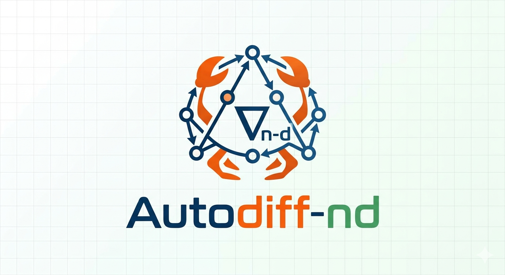

# Autodiff-nd 🦀📐

  

**Autodiff-nd** is a lightweight Automatic Differentiation (Autograd) library for Rust,
leveraging the power of `ndarray` for high-performance N-Dimensional tensor operations.
